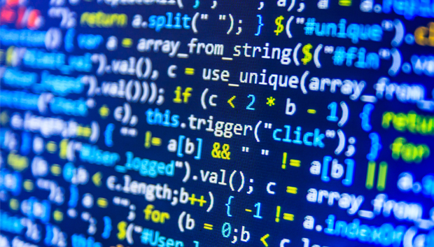

Coding can be very useful.  Unless you don’t know how to use it.  Then what’s the point?  I know how to program an algorithm to do a binary search through a sorted array and tell you it’s run time is Θ(log n), but there is so much more to being a programmer.  This is why I am so interested in software engineering.  I want to go places with my coding, and I believe this is the route to go.

I started robotics in second grade, where my journey with programming also began.  It was of course the very basic click-and-drag programming, but it was a start.  Watching my code come to life was the coolest thing.  The next year I did robotics was in the 5th grade, and I never stopped since.  I continued through high school, and as I progressed, so did my programming abilities.  I learned a lot, but I had still not yet reached raw code.

When I came to the University of Hawaii, I was so excited.  I was finally going to learn how to write using different programming languages and become an anti-hacker!  Well, I’m still working on those two, but I have definitely learned a lot already.  I now know a good chunk about Java and I’m slowly weaning my way into Python.  My hopes for this software engineering class is that by the end, I will be able to confidently say I know how to and can build a website.

I also love how this class has a professional development aspect.  The world needs to stop thinking of computer scientists as the anti-social smart people.  I’d like to think I have the social skills needed to make it through this world, but I am still learning.  I realize now that employers look not only at yourself in person, but also the person you are on the web.  I know that this class will point me in all the right directions so that I may be successful in my endeavors.
