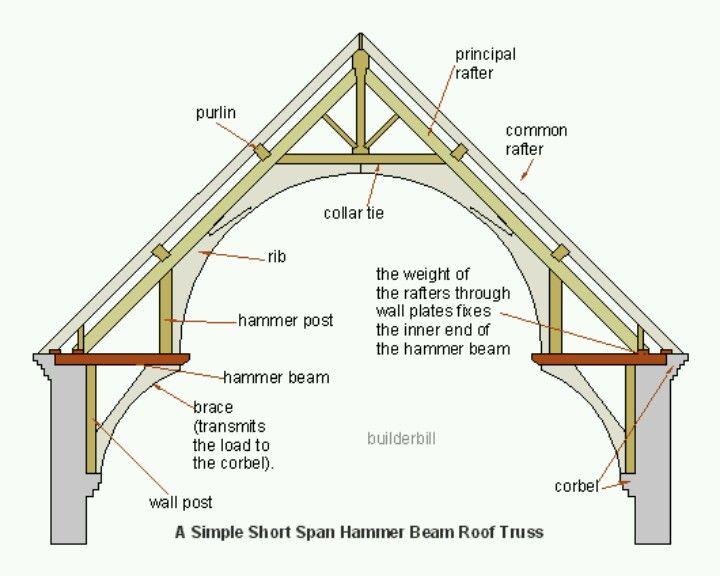

## Architecture and Software Engineering

As I travel deeper into software engineering and computer science in general, I have realized many similarities between architecture and coding.  Both have structures, both can be simplified into simpler planning parts (blueprints and pseudocode), and more recently I have realized that both make use of design patterns.

Design patterns are reusable solutions to common problems.  In architecture, an example of a design pattern is a roof shape.  For different places, based on the conditions, you may use a different roof shape, but you generally follow the same design pattern.  In software engineering, an example of a design pattern is having a basic layout for a website, which can be reused to create a similar website.  This basic layout can be like a skeletal structure, and based on your needs, you can customize the rest of it.  

Design patterns are great for beginner programmers.  As a fairly novice programmer myself, I found that learning through design patterns is one of the better ways for me to learn. It allows me to get used to new terms and techniques.  Using this template, I can then play around with changing it and adding to it, based on my needs, which are usually smaller projects.

I would like to think of it that architecture students are doing something similar.  They do not go and build a house their first day of class.  They start off with building smaller model projects and can play around with different structures.  The more I think about it, the more I see the similarities between architecture and programming.
