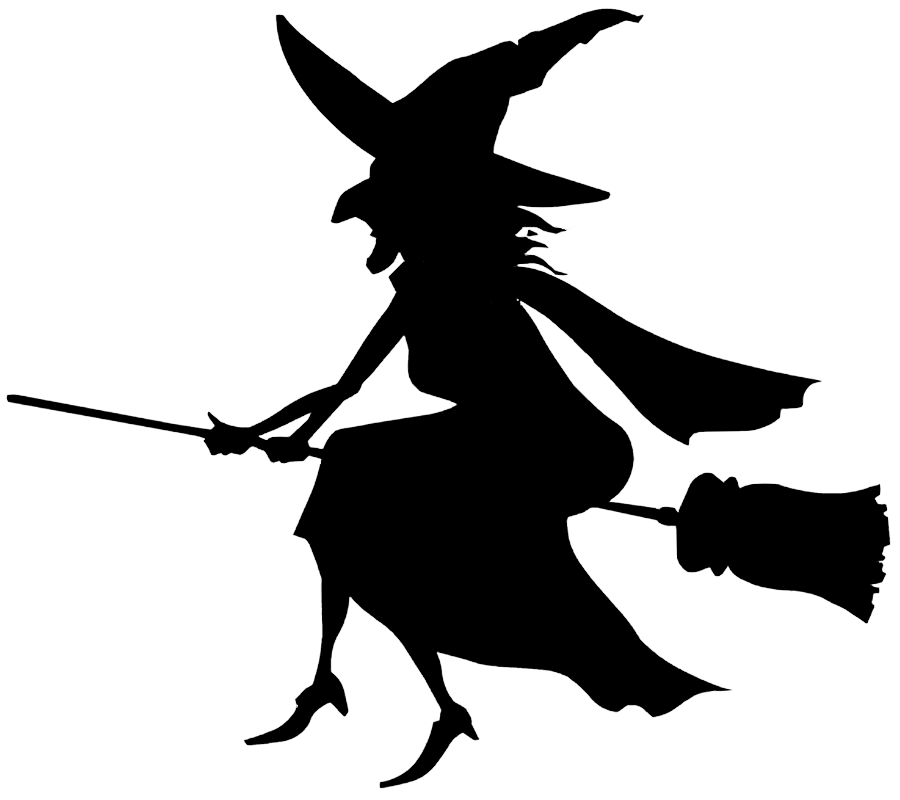
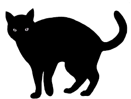

  
  
  

This is my second project of ICS 111.  It was around halloween so I tried to have some halloween spirit.  This project demonstrated my ability to make objects complete a series of movements, including translating and rotating, as well as play sounds.

You can view my repository [here](https://github.com/Olivia-Murray/ICS111-Project2).
