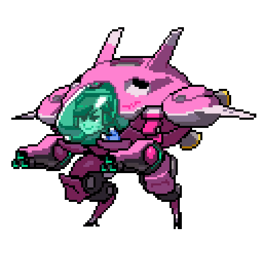
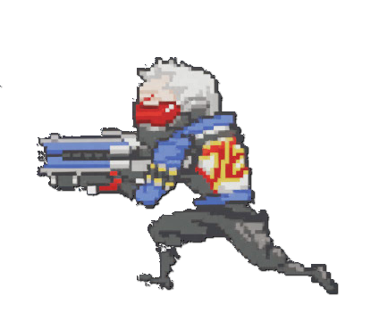
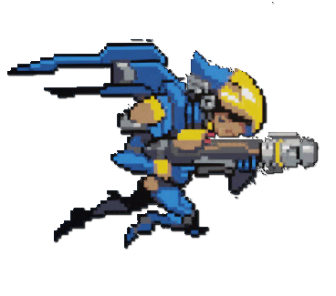

  
  
  

This was my first ICS 111 coding project that really got me interested in ICS. The goal of this game is click keys “A” and “S” (A and then S or S and then A, not at the same time) as fast as possible to move across the screen. The leader will be updated once a new leader has taken first place, and is verbally announced.

This was an enjoyable project for me.  I chose something I was interested in (Overwatch) and incorporated it into my project.  I also used my friend as the voice to the game.  It was very satisfying to see my first programming project coming together.  I learned about the many parts that go into a project, no matter how simple it may be.  I also learned that projects take a lot of time.  I definitely put more time into this project than I had anticipated, but I allotted myself enough time.

You can view my repository [here](https://github.com/Olivia-Murray/ICS111-Project1).

